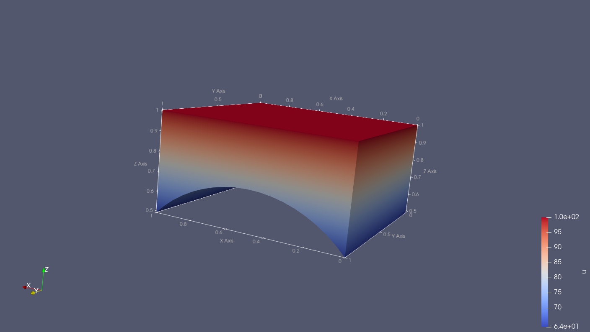
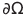
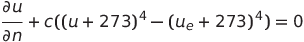
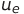

**Zadatak**. Zadana je domena 
 (datoteka `transfinite-3D-simplex.msh`) prikazana na slici:

Riješavamo zadaću distribucije temperature  domeni .
Materijal je homogen i nema vanjskog volumnog izvora topine,  tako da
temperatura `u` zadovoljava Laplaceouvu jednadžbu. Na gornjoj plohi
granice , `z=1`, zadana je stalna  temperatura od 100 stupnjeva C
(temperaturna skala je Celzijeva). Bočne stranice su termički izolirane,
a donja zakrivljena strana zrači toplinu prema Stefan-Boltzmanovom 
zakonu, tako da na njoj imamo rubni uvjet:

.

Konstanta c iznosi 1E-8, a ambijentalna temperatura  iznosi 25 stupnjeva C.
Izračunajte distribuciju temperature u domeni  .

